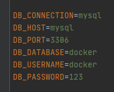
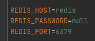

# Servers for Laravel framework 


## Introduction

This part of repository contains various Docker-Compose templates,
for using with Laravel Framework.


### Installation LEMP/LEPP
Before we start, prepare your folder with laravel project or create new project. Example:

```shell
mkdir project-name
cd project-name
composer create-project --prefer-dist laravel/laravel .
```

Copy the contents of the folder, example LEMP,
to the folder with your project and prepare your .env file. REDIS_HOST or another hosts sometimes must be the Docker IP address instead name. 




After run the following commands in the terminal.

```shell
docker-compose up --build -d
docker-compose run php-fpm php artisan key:generate
docker-compose run php-fpm php artisan storage:link
```

If Storage:link command does not work, maybe your host machine is Windows. 
If you have PHP on host machine, run native command, or create link manually.

```shell
php artisan storage:link
```

### Open in browser

To start, find out your Docker IP address. For this, use command ipconfig (Windows), or ifconfig (Unix) in your shell.
Example, my docker ip is: 192.168.99.100.

Examples of access for different servers:

Your project:

[http://192.168.99.100:8080](http://192.168.99.100:8080)

phpMyAdmin:

[http://192.168.99.100:8090](http://192.168.99.100:8090)

Adminer:

[http://192.168.99.100:6060](http://192.168.99.100:6060)


### Migration

```shell
docker-compose run php-fpm php artisan migrate
```

### Composer

For using Composer use commands like this:

```shell
docker-compose run composer update
```

### NPM

Prepare: in the console of the machine, need install "cross-env", then re-install dependency:

```shell
docker-compose run node npm install -global cross-env
docker-compose run node rm -rf node_modules && npm install
```
After you may use needed commands, example:

```shell
docker-compose run node npm run dev
```

### Run tests

```shell
docker-compose run php-fpm php artisan test
```

### Redis

Setup. Check "bind" in the redis.conf (YOUR_PROJECT/docker/redis/redis.conf)
and replace IP address (docker ip) if yours is different. 

Check Redis
```
docker-compose exec redis sh
redis-cli
ping
```
Must return "PONG"
