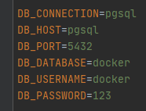

# Simple Servers 


## Introduction

This part of repository contains various Docker-Compose templates,
with more popular servers.


### Installation

Copy the contents of the folder, example LEMP,
to the folder with your project.

After run the following commands in the terminal.

```shell
docker-compose up --build -d
```

### Open in browser

To start, find out your Docker IP address. For this, use command ipconfig (Windows), or ifconfig (Unix) in your shell.
Example, my docker ip is: 192.168.99.100.

Examples of access for different servers:

Your project:

[http://192.168.99.100:8080](http://192.168.99.100:8080)

phpMyAdmin:

[http://192.168.99.100:8090](http://192.168.99.100:8090)

Adminer:

[http://192.168.99.100:6060](http://192.168.99.100:6060)


### PHP

Using from the console.

Run commands:
```
docker-compose run php -v;
```

Enter inside the container:
```
docker-compose exec php sh
```


### Databases

Using from the console.

Run commands:
```
docker-compose run mysql -V
```
Enter inside the container:
```
docker-compose exec mysql sh
```

Access:

MySQL


PostgreSQL



### Composer

Run commands:
```shell
docker-compose run composer update
```
